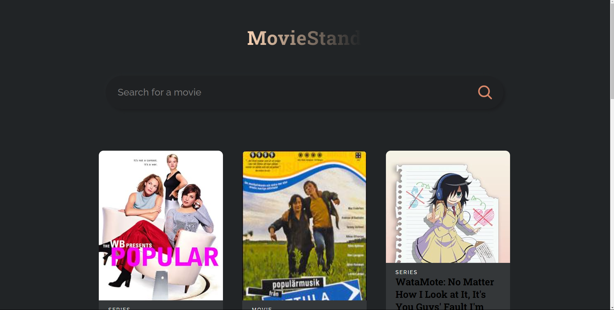

---

# Movie App 🎬

<p align="center">
  
</p>


Welcome to the **Movie App**, a React-based web application that allows users to search and explore their favorite movies. This project leverages the OMDB API to fetch movie data and present it in a clean, user-friendly interface.

## Features

- **Search Functionality:** Users can search for movies by title.
- **Popular Movies:** Display a list of popular movies or recently searched movies on page load.
- **Responsive Design:** The application is fully responsive and works across all devices.
- **Dynamic Movie Cards:** Each movie is presented with a card that includes its title, release year, type, and poster image.
- **Clean UI:** A simple and clean user interface built with React.

## Tech Stack

- **React**: JavaScript library for building user interfaces.
- **OMDB API**: External API to fetch movie data.
- **CSS**: Custom styling for the user interface.

## Getting Started

To get a local copy up and running, follow these simple steps.

### Prerequisites

Make sure you have the following installed:

- Node.js
- npm (Node Package Manager)

### Installation

1. Clone the repository:

   ```bash
   git clone https://github.com/Nitesh-18/Movie-App.git
   ```

2. Navigate to the project directory:

   ```bash
   cd Movie-App
   ```

3. Install the required dependencies:

   ```bash
   npm install
   ```

4. Start the development server:

   ```bash
   npm start
   ```

5. Open your browser and visit `http://localhost:3000` to see the app in action.

### Building for Production

To build the project for production, run:

```bash
npm run build
```

This will create an optimized build in the `build/` directory, ready to be deployed.

## Deployment

This application can be easily deployed on platforms like Vercel, Netlify, or GitHub Pages.

### Deploying to Vercel

1. Make sure you have a Vercel account and the Vercel CLI installed.
2. From the root of your project, run:

   ```bash
   vercel
   ```

3. Follow the prompts to deploy your application.

## API Reference

This project uses the [OMDB API](http://www.omdbapi.com/) to fetch movie data.

- **API Key:** You'll need to register and get your own API key from OMDB.
- **Usage:** Replace the API key in `App.js` with your own.

```javascript
const API_URL = "http://www.omdbapi.com?apikey=YOUR_API_KEY";
```

## Contributing

Contributions are what make the open-source community such an amazing place to learn, inspire, and create. Any contributions you make are **greatly appreciated**.

1. Fork the project.
2. Create your feature branch: `git checkout -b feature/YourFeature`.
3. Commit your changes: `git commit -m 'Add some YourFeature'`.
4. Push to the branch: `git push origin feature/YourFeature`.
5. Open a pull request.

## License

Distributed under the MIT License. See `LICENSE` for more information.

## Contact

Nitesh Ranjankar - [LinkedIn](https://www.linkedin.com/in/nitesh-r-a15518243/)

Project Link: [https://github.com/Nitesh-18/Movie-App](https://github.com/Nitesh-18/Movie-App)

---
